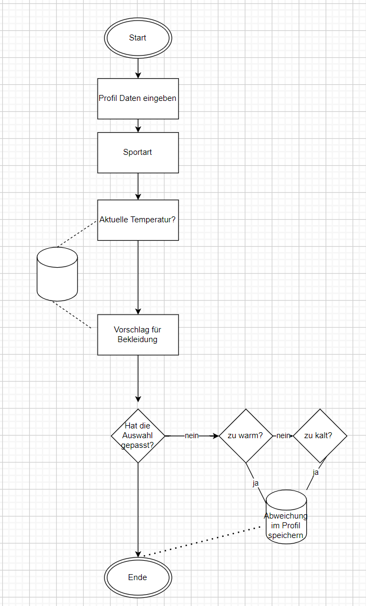

# 🎽🌧 ☀ ❄ clothes selector 
Welcome to my phyton tool clothes selector. 
It should have been a helper to choice the right sports clothes based on the temperature.

##💡 project idea
for people who like to be outside and do some kind of sport it can be difficult which 
clothes you should be wearing. If you wear too much you may overheat or if you wear 
less you may get a cold. So this clothes selector may helps to find the most suitable clothes
based on the temperature. 

##💡 Functions
- Create User profil
- Search for user
- Search for clothes 
- clothes catalog 

## 👷 workflow
- Keen in Name, Age, Sex, Region
- Keen in the current temperature
- Keen in your sport you would like to do

## 🏁 Walkthrough
The application will be displaded in any Browser. I recommend Chrome. Edge can cause problems sometimes
URL http:// (Needs to be set up later or just visit my re)

##github
Lintk to my code https://github.com/Ironi88/Ironi

Janina meine Heldin hatte eine Idee
Strava 2.0 
test you Fitness level (Piramide)

Projektname: IroniTec Run towards your Goal
##Inhalt
1. Ausgangslage des Projekts
2. Funktion/Projektidee
3. Ablaufdiagramm
4. Anleitung/Walkthrough
5. FAQ's

##Ausgangslage des Projekts
Velotagebuch, Massnahmen zur Verbesserung

##Funktion/Projektidee
Erfassen: Vorname, Nachname, Ort, Alter, Grösse, Gewicht, Datum, Uhrzeit
Gefühlslevel (Vorgabe Skala-1-10), gefahere km, gefahrene hm, durchschit.  Temp., 
Wetter (Sonnig, bewölkt, windig, schnee, regen)

Verarbeitung: speichern Datenbank, pro 100k und oder  1000hm gibt es ein Steinbock emoji

Ausgabe: Trainingspensum pro Woche, Monat, länge der Strecken
Angabe über den Status der Steinbocksammlung 
Challange 10 Steinbock 

##Ablaufdiagramm

##Anleitung/Walkthrough

##FAQ's

