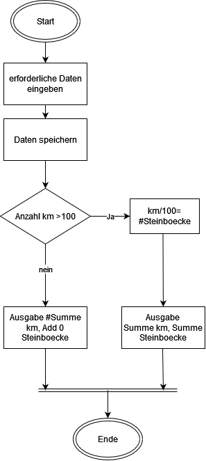

# 🚴 ️VeloMio  🚴‍♀ <!-- Plug in Emoji Support einfügen  :emjoiname -->
☝ Mein erstes Python Programm  ☝ 

## Inhaltsübersicht
1. Problembeschreibung/Motivation
2. Benutzung
3. Architektur 
4. Ungelöste Themen und Verbesserungsvorschläge 
5. Link to github

##1. Problembeschreibung/Motivation
Die Projektidee hängt sehr stark mit meinem Hobby Triathlon zusammen. 
Das Programm beschränkt sich, aber auf eine der drei Disziplinen, dem Radfahren. 
Beim Sport ist es extrem wichtig ein hohes Level an intrinsische Motivation zu haben. 
Sonst bleibt die persönliche Verbesserung aus und dies führt oft zu Abbruch der Aktivität. 
Eine Dokumentation und ein Ziel fördert die Motivation. 
Ein Ziel vor Augen treibt die Menschen an und es kommt Bewegung ins Spiel. 
Das Spiel wurde für das Team von sportbenzin.ch programmiert. 

##2. Betrieb 
- Flask, Plottly und Json werden benötigt
- Main.py muss als erstes ausgeführt werden

##3. Benutzung
Erfassen: Vorname, Datum und Kilometer
Verarbeitung: speichern Datenbank, Filter Funktion für die oben genannten Values 
Punkte System der pro 100k gibt es ein Steinbock. 

Ausgabe: Gesammelte KM zeigen die gesammelte Anzahl der Steinbock an

##3.👀 Architektur 
<!-- Erstellt im dawio 
https://app.diagrams.net/#G1lI50nTNPo-A5iqcfEOgooin0duN972aB -->

##4.Ungelöste/unbearbeitete Probleme
Was wurde nicht gelöst?
Die Variablen bei der Berechnung sind sehr spezifisch auf die Personen. 
Wenn das Programm erweitert würde und noch mehr Personen dazu kommen, 
müsste das anders gelöst werden. 
Der Code würde sonst unübersichtlich und Änderungen sind mühsam vorzunehmen. 
Welche Verbesserungen könnten noch gemacht werden?
- Weitere Optionen hinzufügen um Steinboecke zu sammeln
- Challenge Ende definieren

##5. Link to github
Link to my code https://github.com/Ironi88/Ironi

